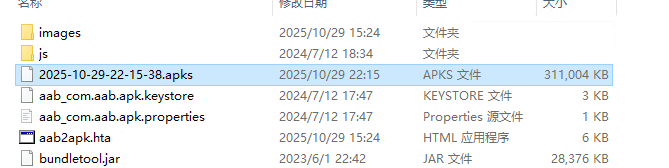

# AAB导出APK

## 说明

Google Play 自2021年8月起强制要求新应用必须使用AAB格式提交，这使得项目发布时需要从APK换成AAB，然而AAB格式又不能直接安装，需要使用官方提供工具`bundletool`进行转换，转换过程是一个命令行操作，对于一些测试人员相对复杂，所以做了这个简易的图形界面用来调度`bundletool`完成AAB到APK的转换，提高生产效率。

## 环境搭建

1. 安装JDK（如果已经安装可以跳过）
2. 安装WinRAR（如果已经安装可以跳过）
    * 因为使用bundletool转换出来的是一个压缩包（xxx.apks），需要做一次解压，我这里使用的是winrar
    * 下载地址：https://www.win-rar.com/download.html
    * 如果想使用其他解压工具，请跳转到 [自定义解压工具](#自定义解压工具)
3. 项目中自带了一份bundletool.jar，版本是1.15.1，如果不满足需求请自行下载对应版本的bundletool.jar
    * 下载地址：https://github.com/google/bundletool/releases
    * 下载完成后需要将名字修改成bundletool.jar，替换项目中的bundletool.jar

## 证书说明

工具中自带了一份证书，如果需要使用指定的证书需要按照示例证书存放

* 证书名称：${cert}.keystore
* 证书信息：${cert}.properties
    * 证书信息中包含证书的密码和别名信息，详细请查看示例`aab_com.aab.apk.properties`

# 操作步骤

1. 双击`aab2apk.hta`打开界面，并选中对应的aab文件
2. 选择对应的证书（证书只要按照规范放到目录下即可在下拉框里选择）

3. 点击导出，弹框提示导出成功

4. 点击确定后会自动打开`winrar`进行解压

5. 转换后的APK文件会按照时间命名放入工具目录中

# 自定义解压工具

可能因为某些原因需要使用其他的解压工具，或者不需要再转换成功之后自动解压，可以用文本编辑器打开`aab2apk.hta`修改118行代码即可。

# 特别说明

因为自己的项目开发都是在windows上，所以这里使用了HTA的技术进行桌面程序开发，使得工具只能在windows上运行。
最后的最后，如果觉得这个工具对你有帮助，欢迎给我点个小星星⭐️，谢谢！
